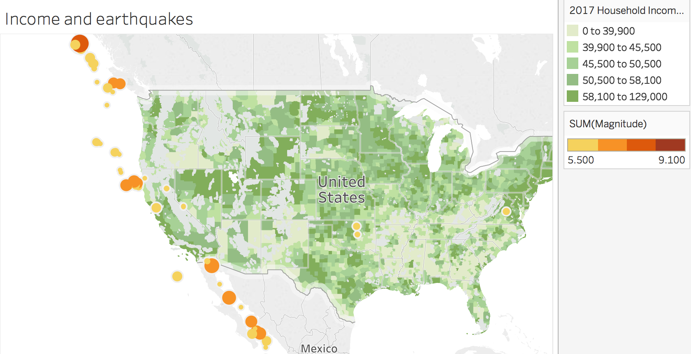

# Earthquake and Unemployment Maps

## Instructions for Earthqauke Maps

### Part I

* Use `earthquakes_database.csv` to plot the magnitude of earthquakes measured from 2010 to 2016.

  * Earthquakes should be stratified by magnitude, using the `size` and `color` marks. 
  * Use Tableau's built-in census data to determine whether any relationship exists between earthquakes and 2017 median household income, by county.
  
    

### Part II

* In a separate worksheet, determine whether there has been any trend in the magnitude of earthquakes measured globally over the years. 

### Part III

* Create a global map of earthquakes, with each earthquake's magnitude reflected on the map by size and color. Remember that the Richter scale is logarithmic. How might you reflect this relationship on the map?

### Bonus

* Try to see what other interesting visualizations you can come up with! Feel free to Slack your visualizations to the class.

## Instructions for Unemployment Maps

* Use `employment.csv`, a dataset constructed from the Bureau of Labor Statics data, to visualize unemployment in the United States.

### Part I

* Create a map of unemployment between 2008 and 2016, by county. Which areas in the United States have been the hardest hit during that period?

### Part II 

* Create an unemployment map, by county, during the period 1990-1998. How does it compare and contrast with the map from 2008-16?

### Part III 

* Create a map of counties with the highest rates of unemployment between 2008 and 2016. Use Tableau's built-in census data to discover the relationship, if any, between counties with the highest rates of unemployment and the median per capita income, by county. Which counties had the highest unemployment rate during this period?

### Bonus

* Come up with other visualizations, perhaps looking at the relationship between race and unemployment on a county-by-county basis.

---

© 2022 edX Boot Camps LLC. Confidential and Proprietary. All Rights Reserved.
