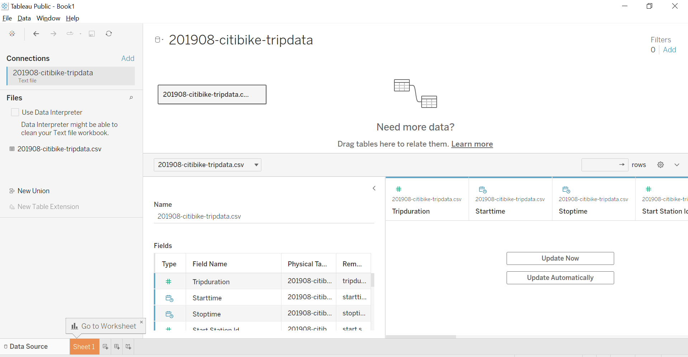
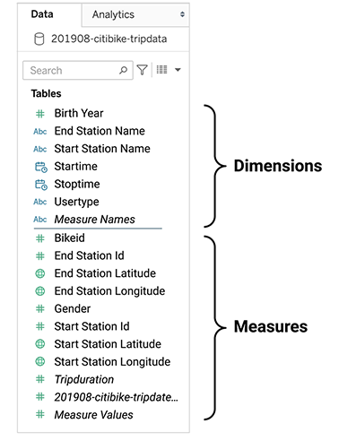
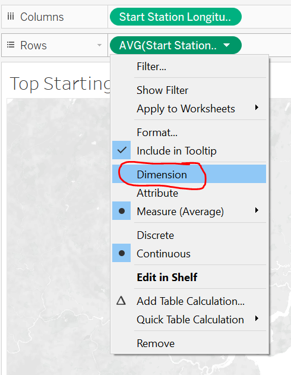
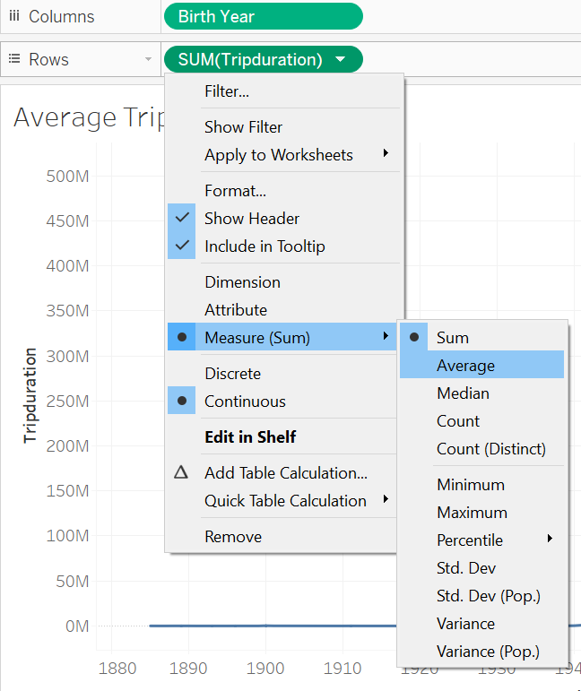
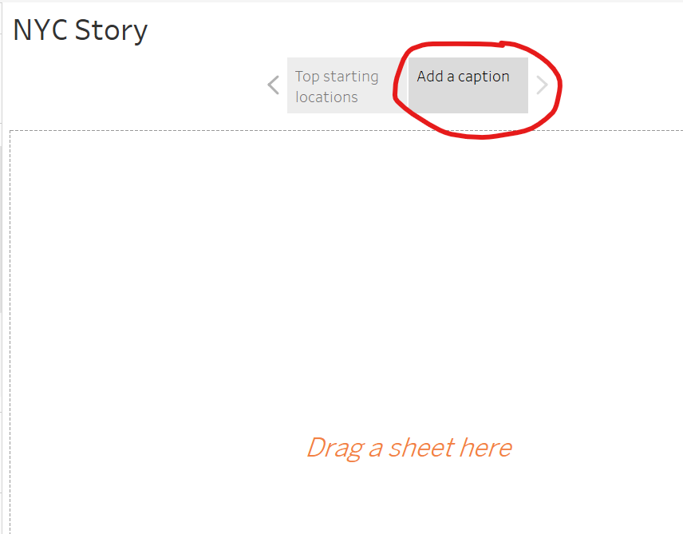
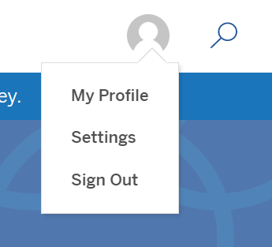
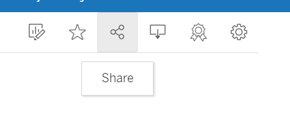
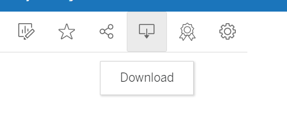

# Module 15 - Tableau

## Module Supplement 

*NOTE: Throughout this module please be aware that Tableau tries to automatically decide on chart types, measure calculations, ect to aid in your creation of visualizations. Please know that when you are dragging things over to where they belong in a worksheet and following along with the module, you may have to make changes if Tableau doesn't automatically select the same thing that the module is expecting. I note how to make some of these changes when I experienced differences in the automation vs what the module expected to see.* 

*REMINDER: This audit is going through the Module itself and the Challenge - not the class activities.*

## 15.1.4 - Import Data into Tableau

When you connect the csv data source, you application should like something like the image below. The module shows an image of the data preview. If your application shows the connected file as mine does in the image, you should be able to click **Update Now** in the bottom right pane. That should then show you a preview of the data if it wasn't already displaying. You should have the ability to resize the data preview pane, by dragging up on the divider above. You can also minimize the pane to the left of the data preview by clicking on the **<** button. 

After reading through what else the module explains about changing column names/data types, just continue learning about Tableau in the Module. You will come back to the Tableau application in **15.2.1**

## 15.2.1 - Set Up Your Tableau Workspace

In order to see the datapane that is being described, please select the **Sheet 1** tab at the bottom of your tableau application. It should still be on your data preview up until this point. Once you open up "Sheet 1", you should see the datapane on the right-hand side of the sheet. Throughout this part of the module you will simply be reading more details about Tableau before we get into creating anything. Feel free to poke around if you want to while learning about the different aspects of Tableau Sheets, but you don't need to worry about actually following through with any actions in Tableau until **15.2.5**

## 15.2.5 - Determine the Number of Trips

*If you haven't played around with Sheet 1, you can simply rename this sheet to "Number of Rides". If you were just practicing with Sheet 1, feel free to leave it be and follow the module's instructions on creating a new sheet and renaming it to "Number of Rides"*

- `Dimensions` are located in the upper part of the Data Pane section. They are the qualitative values in your dataset, such as names, dates, and geographical data. You can use dimensions to categorize, segment, and reveal the details in your data.

- `Measures` are located in the lower part of the Data Pane section. They are the quantitative values in your dataset, which are usually numerically measured. You can apply calculations to measures and they can be aggregated. When you drag a measure into Columns, Rows, Filters, or Marks, Tableau automatically applies an aggregation to that measure.

*Note: In order to see `201908-citibike-tripdata.csv (Count)` in the Measures section, you may need to drag to expand the section to read the full names of the Measures.*

## 15.2.6 - Find the Proportion of Short Term Customers to Annual Subscribers

- In order to get a pie chart, if it doesn't automatically select a pie chart when you drag `Usertype` to the Color marks, you will need to select the dropdown under **Marks** that says Automatic and change it to Pie.

## 15.2.7 - Find the Peak Riding Hours in August

- Similar to the section above, you may need to select `Bar` under the **Marks** dropdown, if Tableau doesn't automatically choose that chart type. The module also mentions another way to change the chart type by using the **Show Me** button in the top right pane of the worksheet. 

## 15.3.1 - Find Top Starting Locations

- If the Lat & Lng measures have *AVG()* or some other aggregate function around them in the Columns and Rows section, you need to change it from a *Measure* to a *Dimension* by clicking the dropdown on the pill in the Column/Row and select **Dimension** as shown in the image below: 

- When you drag the `201908-citibike-tripdata.csv (Count)` measure to the Size marks icon, if the marks are not circles like in the module image make sure that `Automatic` is selected under the **Marks** dropdown. 
    - If your circles seem too big and are all overlapping each other, you can resize the circles from the legend on the right-hand size of the worksheet. If you hover over the CNT() text, a dropdown arrow should appear. Click on the arrow and then choose **Edit Sizes**. You can then adjust the size of the marks.

## 15.3.1 - Find the Number of Rides by Gender

- After dragging Gender to the colors Mark, you may need to change the Mark type to Pie. 
- It is okay if your color scheme of your pie chart is different than that of the Module's image.

## 15.3.3 - Find the Number of Rides by Gender

- When you change the Gender Measure to a *string*, you may need to also choose "Convert to Dimension" if it doesn't move it up to the Dimensions portion of the Data Pane.
- When creating the calculated field, here are some Tableau documentation links that may help:
    - [Function Operators](https://help.tableau.com/current/pro/desktop/en-us/functions_operators.htm)
    - [Functions in Tableau](https://help.tableau.com/current/pro/desktop/en-us/functions.htm)

## 15.3.4 - Find the Average Trip Duration by Age

- *Reminder: In order to change the calculation used on a measure when you have it in the Rows/Columns section, click on the dropdown in the pill then change the Measure calculation by hovering over Measure and selecting the calculation you want to use.*
    - 

## 15.4.2 - Dashboard Best Practices

**Highlighting**
- You need to drag `August Peak Hours` from the Sheets pane on the left, into the dashboard in order to test out highlighting.

## 15.4.3 - Add Worksheets to the Citi Bike Dashboard

*NOTE: If you dragged a sheet into the Dashboard for the previous section to practice anything, you can remove them from the dashboard by clicking the little `x` at the top right corner of the sheet on the dashboard.*

- When adding the `Average Trip Duration` sheet to the dashboard, it may already be *floating* from when you selected Floating for the Title. However, you can change it to tiled or change the floating order in the way the dashboard explains. You can make your sheet look similar to the module image by dragging and resizing the edges of the sheet on the dashboard. 

- When it says add `Number of Trips` they mean the sheet you named `Number of Rides`. You may need to decrease rather than increase the size of the text from the Worksheet itself. But play around with it to make it look similar to the image in the module on the Dashboard.

## 15.5.1 - Introduction to Tableau Stories

- You can change the title of the Story by double clicking on `Story 1` and renaming it to *NYC Story*

- To add a text description, from the left hand pane you will need to drag over `Drag to add text` into the story. The module adds the text "There might be more tourist here". You can resize the text or change the style by double clicking on the text. 

- When adding a new story point, you can change the name of the story point by double clicking on the box itself and changing the text. This is meant to help you present each point. 
    - 

## Saving your module work to Tableau Public
- Once you have completed the module assessments, you will need to save your file to Tableau Public
    - File > Save to Tableau Public... > Sign in and choose a name for the file

- - -

## Class Material Reviews

### Class 1
- Importing data into Tableau was covered in Lesson **15.1.4**
- Learning how to use Tableau and creating basic visuals were covered in Lessons **15.2.5 - 15.2.7**
- An overview of the “Marks” section was covered in Lesson **15.2.2** And using the “Marks” section was covered throughout the module.

### Class 2
- Creating geospatial maps was covered in Lesson **15.3.1**
- Creating a dashboard was covered in Lesson **15.4.1**
- Creating a story was covered in Lesson **15.5.1**

- - -

## Challenge Instruction Supplement

*NOTE: To remove a pill from the columns/row or filters/marks pane, simply drag the pill back to the data pane*

### Deliverable 1

- You may need to refer back to your previous Python modules on Pandas and datetime objects in order to complete this section.

- When importing the `201908-citibike-tripdata.csv` into pandas (this is the file you downloaded at the beginning of the module), you may want to include `low-memory=False` as a second argument into the read_csv() function if you get a low-memory warning.

- When converting the tripdruation to datetime, you want the units to be in seconds.

### Deliverable 2

*Create the Checkout Times for Users Viz*
1. The number of records that they are referring to is the *(Count)* measure that we have used throughout the module.
3. Changing the tripduration to `continuous` is in the pill dropdown
4. Drag the `tripduration` dimension into the Filters pane next to the Data pane. Select `Hours`, then select `Next`, then hit `Ok`. To show the filter, click on the arrow on the HOUR(Tripduration) pill in the filters pane, and choose `Show Filter`.

*Create the Checkout Times by Gender Viz*
- Be sure to create a new worksheet for the new visualization.
- *Note* you will need to create the converted/calculated field for Gender in this new dataset like you did in the module (15.3.3)

*Create the Trips by Weekday for Each Hour Viz*
4. Right click on the Y-axis and select `Format..`, this should open up the pane that is shown in the module image. Under Default > Dates > select 12-Hour
6. You can change the color of your heatmap if you want from the legend. Right click on the legend with the colors, and select *Edit Colors..*

### Saving/Submitting Tableau Workbook
- Once you have completed creating the worksheets and story, you will need to save your file to Tableau Public
    - File > Save to Tableau Public... > Sign in and choose a name for the file
- Once you have saved the file, you will want to log into [Tableau Public](https://public.tableau.com/app/discover), then go to your profile by clicking on the User Image icon and choosing `My Profile`
    - 
- In your profile, you should see your saved **Vizzes**. Click on your saved challenge.
    - To get the public URL for your workbook, click on the Share icon in the top right corner and copy the URL to include in your Challenge README
        - 
    - If you want to download the Tableau Public Workbook, click on the Download icon in the top right corner and select `Tableau Workbook`
        - 

